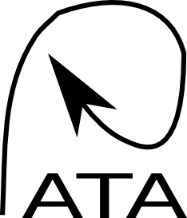

# Project for Another Trajectory Algorithm

The aim of this project is to explore different ways for estimating particle trajectories given an initial subset of trajectories. The trajectories follow some dynamics and the equations that describe the dynamics are known. In rough the idea is to jump between computing new trajectories from the dynamics or to use the existing trajectories as a basis and estimate the new trajectory by "interpolation". There are three main challenges:

1. Understand what and how can we estimate/interpolate
1. Understand how can we make decisions on when to estimate or to simply use the physics
1. How can we run this efficiently

Python and stuff for other stuff.

## Goals

1. Calculate trajectories
1. Build a database
1. Use Keras for deep learning: teach a NN to learn the physics behind the process.
1. Use open-source tools: tensforflow, keras, pandas.
1. Ducks!

## Quack